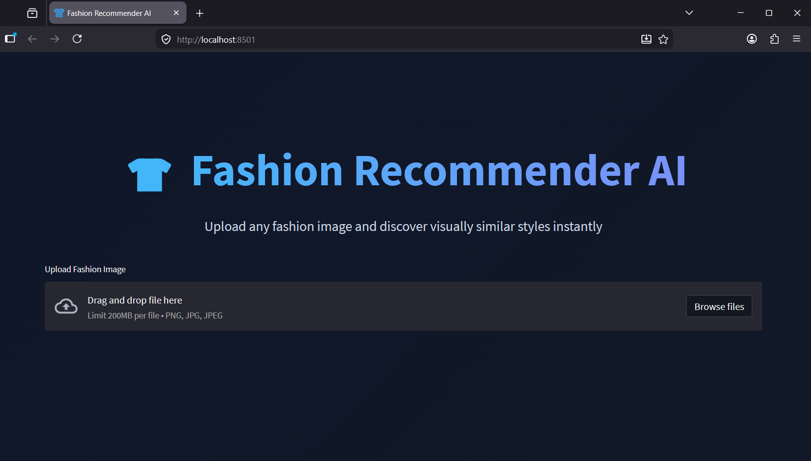
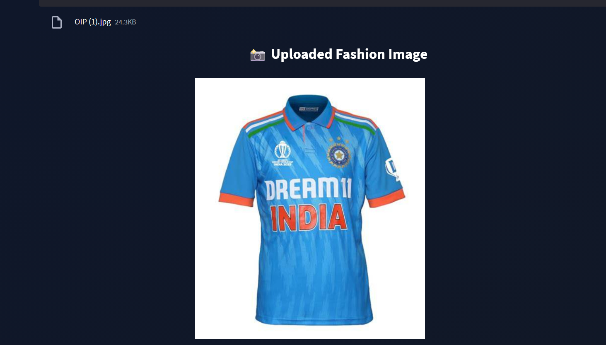
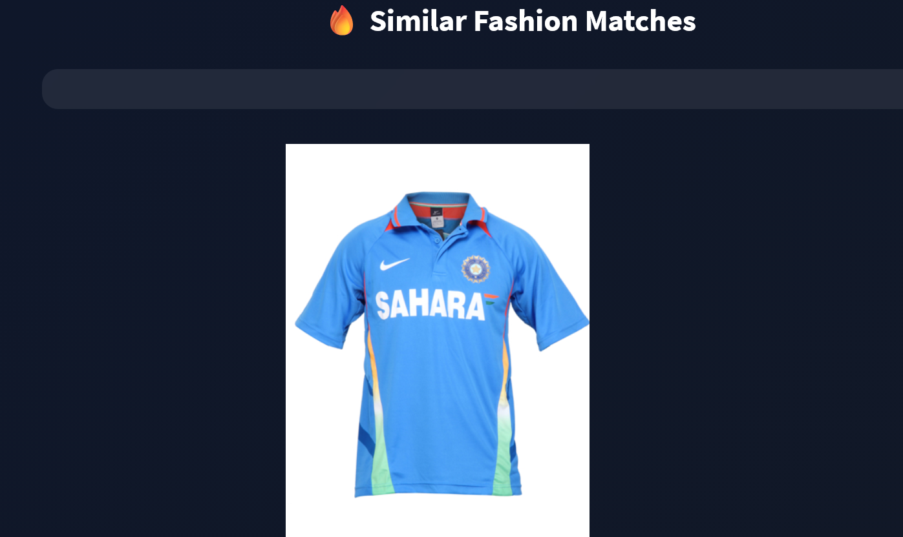

# AI Fashion Recommender System 👕

An AI-powered Fashion Recommendation System developed using TensorFlow, ResNet50, Streamlit, and Nearest Neighbors.

## Features
- Upload fashion images
- AI-based fashion recommendations
- Modern responsive UI
- Match percentage display
- Interactive recommendation cards

## Tech Stack
- Python
- TensorFlow
- Streamlit
- ResNet50
- Scikit-learn
- NumPy
- Pillow

## Project Screenshots

### Home UI


### Uploaded Image


### Recommendation Results


## Run Locally

```bash
streamlit run main.py
